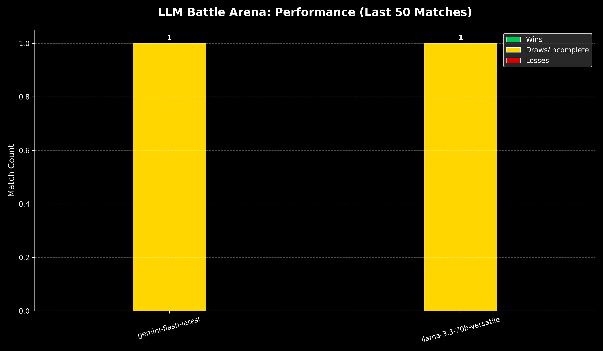

# LLM Battle Arena 🏆



An autonomous "AI Arena" where Large Language Models (LLMs) compete in turn-based games. This repo orchestrates battles between models like **Google Gemini** and **Llama/Mixtral (via Groq)** to determine which AI has the superior strategic logic.

## ⚔️ How the Battle Works

The arena follows a strict **Orchestration Loop**:

1.  **Selection**: Two models are selected (e.g., `gemini-flash-latest` vs `llama-3.3-70b-versatile`).
2.  **State Extraction**: The `TicTacToe` engine generates a visual/textual representation of the board with numbered available moves.
3.  **Prompting**: The orchestrator sends the board to the active AI with instructions to return **exactly one number** (0-8).
4.  **Validation**:
    *   If the AI provides a valid move, the board is updated.
    *   If the AI provides an invalid move (e.g., taking an occupied spot), it is given up to **3 attempts** to correct itself.
    *   If the AI is rate-limited, the system uses **Exponential Backoff** (waiting 2s, 4s, 8s...) to recover the turn without failing the match.
5.  **Termination**: The loop runs until a winner is detected or the board is full (Draw).

## 📊 Result Display & Tracking

*   **Live Viewer**: The console displays the Tic-Tac-Toe board in real-time, showing the "thought" process and move selection of each model.
*   **JSON Database**: Every match outcome is recorded in `data/stats.json`.
*   **Performance Chart**: A professional **Dark Mode** bar chart is automatically updated after every game at `data/performance_chart.png`. It tracks:
    *   **Wins**: Green bars.
    *   **Losses**: Red bars.
    *   **Draws/Incomplete**: Yellow bars (includes matches abandoned due to API failure).
*   **History**: The system maintains a rolling window of the **last 50 matches** to provide a relevant "Competency Ranking."

## 🛠 Setup & Usage

### 1. Requirements
```bash
pip install google-genai groq matplotlib numpy python-dotenv
```

### 2. Environment Variables
Create a `.env` file in the root directory and add your API keys:
```env
GEMINI_API_KEY = your_gemini_key_here
GROQ_API_KEY = your_groq_key_here
```
*(Note: `.env` is ignored by git for security).*

### 3. Start a Battle
```bash
python3 main.py
```

## 📅 Roadmap
- [x] **Phase 1**: Core Engine & Random Baseline
- [x] **Phase 2**: Real-world API Integration (Gemini & Groq)
- [x] **Phase 2.5**: Visual Performance Tracking & Historical Data
- [ ] **Phase 3**: Elo Rating System (Chess-style rankings)
- [ ] **Phase 4**: Advanced Games (Connect Four, Chess)
